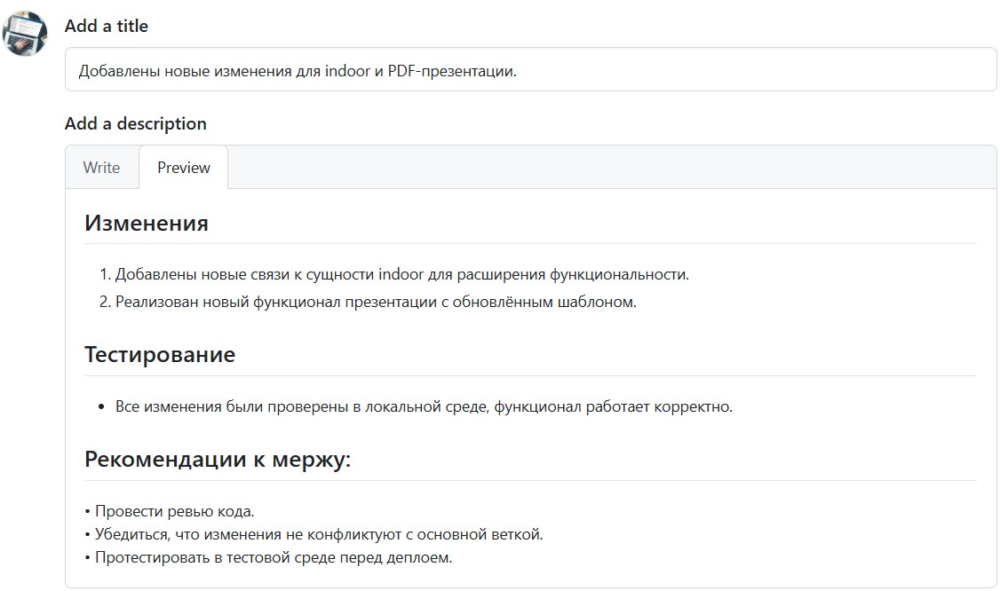

# Pull Request

> Документация GitHub: [docs.github.com/pull-requests](https://docs.github.com/ru/pull-requests)

**Pull Request (PR)** — запрос на слияние вашей ветки в основную. Через PR код проверяют, обсуждают и только потом вливают в `main`.

---

## Когда нужен PR

- Работа в команде
- Код-ревью перед merge
- CI-проверки (тесты, линтер)
- История изменений с описанием задачи

---

## Пример: добавить страницу в GitBook

Задача: добавить страницу `git/pull-request.md` в документацию.

### 1. Обновить main

```bash
git checkout main
git pull origin main
```

### 2. Создать ветку

```bash
git checkout -b docs/git-pull-request
```

Имя ветки: `тип/краткое-описание` — например `docs/`, `feat/`, `fix/`.

### 3. Внести изменения

Создайте файлы, отредактируйте `SUMMARY.md`:

```bash
git status
git add git/pull-request.md SUMMARY.md git/README.md
git commit -m "docs(git): добавить страницу Pull Request с примером"
```

### 4. Отправить ветку на GitHub

```bash
git push -u origin docs/git-pull-request
```

### 5. Создать Pull Request на GitHub

1. Откройте репозиторий на GitHub
2. Появится кнопка **Compare & pull request** — нажмите её  
   Или: вкладка **Pull requests** → **New pull request**
3. Выберите:
   - **base:** `main` (куда вливаем)
   - **compare:** `docs/git-pull-request` (откуда)
4. Заполните описание PR (см. шаблон ниже)
5. Нажмите **Create pull request**

### 6. Ревью и merge

После одобрения:

- **Merge pull request** — слить в `main`
- **Delete branch** — удалить ветку на сервере

Локально:

```bash
git checkout main
git pull origin main
git branch -d docs/git-pull-request
```

---

## Шаблон описания PR

```markdown
## Summary
- Добавлена страница Pull Request в раздел Git
- Обновлены SUMMARY.md и git/README.md

## Test plan
- [ ] npm run serve — страница открывается в меню
- [ ] Проверены ссылки и примеры команд
- [ ] Нет ошибок сборки HonKit

## Связанная задача
Closes #12
```

| Поле | Назначение |
|------|------------|
| **Summary** | Что сделано (2–4 пункта) |
| **Test plan** | Как проверить изменения |
| **Closes #N** | Закрыть issue на GitHub после merge |

---

## Пример PR через GitHub CLI

Установка: [cli.github.com](https://cli.github.com/)

```bash
# Авторизация (один раз)
gh auth login

# Создать PR из текущей ветки
gh pr create --title "docs(git): добавить страницу Pull Request" --body "## Summary
- Добавлена документация по PR с примером для GitBook

## Test plan
- [ ] npm run serve
- [ ] Страница в меню Git"

# Список PR
gh pr list

# Просмотр PR
gh pr view 5

# Merge (после ревью)
gh pr merge 5 --merge
```

---

## Типы merge на GitHub

| Тип | Описание |
|-----|----------|
| **Merge commit** | Обычный merge, сохраняет все коммиты ветки |
| **Squash and merge** | Все коммиты ветки → один коммит в `main` |
| **Rebase and merge** | Линейная история без merge-коммита |

Для документации часто удобен **Squash and merge** — одна запись в истории `main`.

---

## Частые ситуации

### PR устарел — в main появились новые коммиты

```bash
git checkout docs/git-pull-request
git fetch origin
git rebase origin/main
# или: git merge origin/main
git push --force-with-lease
```

### Конфликт при merge

GitHub покажет **This branch has conflicts**. Локально:

```bash
git checkout docs/git-pull-request
git pull origin main
# исправить конфликты в файлах
git add .
git commit -m "fix: resolve merge conflict with main"
git push
```

### Черновик PR

На GitHub: **Create draft pull request** — PR виден команде, но ещё не готов к ревью.

```bash
gh pr create --draft --title "WIP: docs git pull request"
```

---

## Схема процесса

```
main ─────●─────────────●────────── (после merge)
           \           /
ветка ──────●────●────●            (ваши коммиты)
            ↑    ↑    ↑
         commit push  PR
```

1. Ветка от `main`
2. Коммиты в ветке
3. `git push` → PR на GitHub
4. Ревью → Merge → `git pull` на `main`

---

## См. также

- [Удалённый репозиторий](remote.md) — `push`, `pull`, fork
- [Ветки](branches.md) — создание и слияние веток
- [Коммиты](commits.md) — формат сообщений коммитов

---

## Пример оформления PR на GitHub



---

## Как добавить изображение на страницу

В HonKit картинка вставляется **вне** блока кода:

```markdown

```

> Неправильно: писать `image.png` просто текстом или внутри ` ```markdown ` — так картинка не появится.

### Где лежит файл

Ваш скриншот:

```
GitBook/
├── images/
│   └── git/
│       └── pull-request.jpg    ← файл здесь
└── git/
    └── pull-request.md         ← страница здесь
```

Путь от `git/pull-request.md` к картинке: `../images/git/pull-request.jpg`

### Шаги

1. Положите файл в `images/git/` (или `git/images/` — тогда путь `images/файл.jpg`)
2. Вставьте в `.md` **без** обратных кавычек вокруг строки:

```markdown

```

3. Сохраните и обновите браузер (`npm run serve`)

### Варианты путей

| Расположение файла | Путь из `git/pull-request.md` |
|--------------------|-------------------------------|
| `images/git/photo.jpg` | `../images/git/photo.jpg` |
| `git/images/photo.jpg` | `images/photo.jpg` |
| URL в интернете | `https://example.com/photo.png` |

### Форматы

`png`, `jpg`, `jpeg`, `gif`, `svg`, `webp`

---

## Чеклист перед merge

**Тестирование:**
- Все изменения проверены в локальной среде
- `npm run serve` — страницы открываются без ошибок

**Рекомендации к merge:**
- Провести ревью кода
- Убедиться, что нет конфликтов с `main`
- Протестировать перед деплоем

