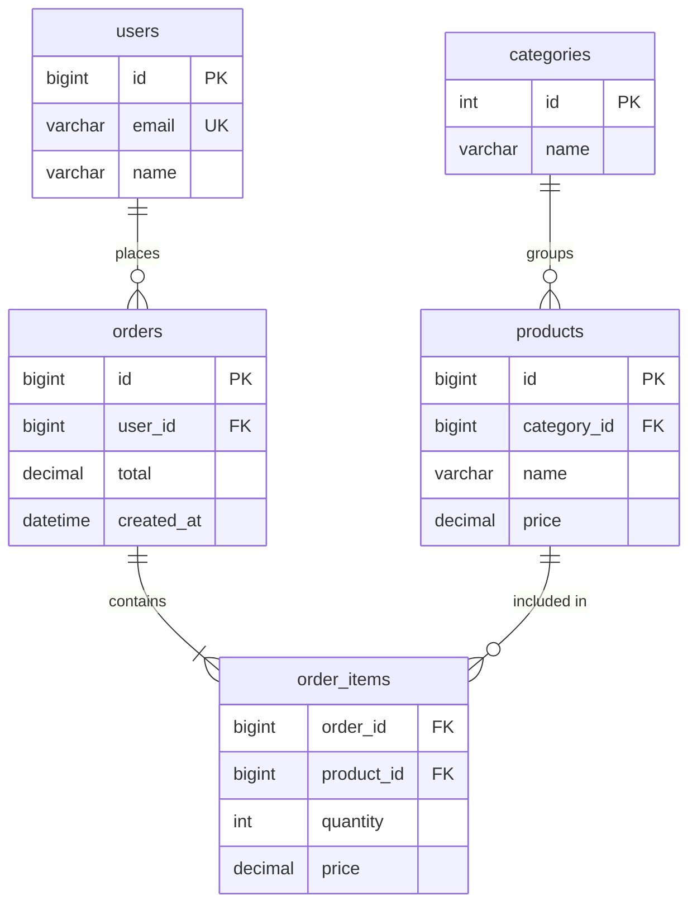
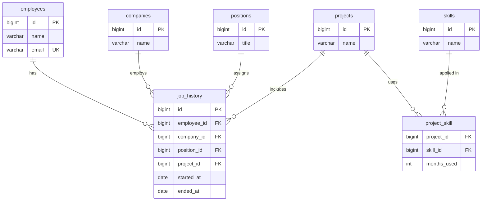

# 3. Проектирование таблиц по ERD

> ERD (Entity-Relationship Diagram) — диаграмма «сущность–связь». Помогает спроектировать структуру БД до написания SQL.  
> Источник: [Основы правил проектирования базы данных](https://habr.com/ru/articles/514364/) (Евгений Грибков, Habr)

Проектирование начинается с предметной области, а не с `CREATE TABLE`. Сначала выделяют сущности и связи, затем переводят схему в таблицы с ключами.

Отношения между сущностями существуют в реальном мире; схема БД — это «снимок» этих отношений на определённый момент. Таблицы — сущности, строки — их экземпляры, связи выражаются через внешние ключи.

## Основные понятия

| Понятие | Описание | Пример |
|---------|----------|--------|
| **Сущность (Entity)** | Объект предметной области | Пользователь, Заказ, Товар |
| **Атрибут** | Свойство сущности | email, цена, дата создания |
| **Связь (Relationship)** | Отношение между сущностями | Пользователь *оформляет* Заказы |
| **Кардинальность** | Сколько экземпляров участвует в связи | один-ко-многим, многие-ко-многим |
| **Обязательность** | Должна ли связь существовать всегда | `NOT NULL` / `NULL` у внешнего ключа |

## Семь формальных правил

Все связи в реляционной модели сводятся к **семи правилам** — комбинации типа связи и обязательности:

| № | Тип связи | Обязательность | Пример |
|---|-----------|----------------|--------|
| 1 | 1:1 | обязательная | Гражданин и паспорт |
| 2 | 1:1 | необязательная | Человек и паспорт другой страны |
| 3 | 1:N | обязательная | Родитель с хотя бы одним ребёнком |
| 4 | 1:N | необязательная | Человек с детьми или без |
| 5 | N:1 | обязательная | Ребёнок с родителем |
| 6 | N:1 | необязательная | Ребёнок в детском доме без родителя |
| 7 | N:M | — | Человек и недвижимость, сотрудник и компании |

Связи **1:N** и **N:1** — зеркальные: FK всегда на стороне «многих». Связь **N:M** в реляционной модели реализуется через промежуточную таблицу.

Одно и то же отношение в жизни может меняться: полная семья — **N:M** между родителями и детьми; после ухода одного родителя — **1:N**; дети в детдоме — **N:1** с необязательной связью; появление попечителей — снова **N:M**.

## Типы связей

### Один к одному (1:1)

У каждой записи в таблице A — не более одной связанной записи в B.

#### Обязательная связь

Пример: у гражданина всегда есть паспорт.

**Вариант 1 — одна таблица:**

```sql
CREATE TABLE citizens (
    id BIGINT UNSIGNED AUTO_INCREMENT PRIMARY KEY,
    name VARCHAR(255) NOT NULL,
    passport_series VARCHAR(10) NOT NULL,
    passport_number VARCHAR(20) NOT NULL,
    passport_issued_at DATE NOT NULL
);
```

**Вариант 2 — две таблицы** (профиль вынесен отдельно):

```sql
CREATE TABLE users (
    id BIGINT UNSIGNED AUTO_INCREMENT PRIMARY KEY,
    email VARCHAR(255) NOT NULL UNIQUE
);

CREATE TABLE profiles (
    user_id BIGINT UNSIGNED PRIMARY KEY,
    bio TEXT,
    avatar_url VARCHAR(500),
    FOREIGN KEY (user_id) REFERENCES users(id) ON DELETE CASCADE
);
```

Внешний ключ в `profiles` одновременно является первичным — гарантирует связь 1:1.

#### Необязательная связь

Пример: человек может иметь или не иметь паспорт конкретной страны. Поле `passport_data` или `profile_id` допускает `NULL`:

```sql
CREATE TABLE persons (
    id BIGINT UNSIGNED AUTO_INCREMENT PRIMARY KEY,
    name VARCHAR(255) NOT NULL,
    passport_id BIGINT UNSIGNED NULL,
    FOREIGN KEY (passport_id) REFERENCES passports(id) ON DELETE SET NULL
);
```

### Один ко многим (1:N)

Одна запись «родителя» связана с несколькими записями «потомка». Самый частый тип связи.

```
users ──< orders
  1        N
```

#### Обязательная связь

У родителя есть хотя бы один ребёнок. FK `parent_id` в дочерней таблице — `NOT NULL`:

```sql
CREATE TABLE orders (
    id BIGINT UNSIGNED AUTO_INCREMENT PRIMARY KEY,
    user_id BIGINT UNSIGNED NOT NULL,
    total DECIMAL(10, 2) NOT NULL,
    created_at TIMESTAMP DEFAULT CURRENT_TIMESTAMP,
    FOREIGN KEY (user_id) REFERENCES users(id) ON DELETE RESTRICT
);
```

#### Необязательная связь

Дети могут отсутствовать — `parent_id` допускает `NULL`:

```sql
CREATE TABLE children (
    id BIGINT UNSIGNED AUTO_INCREMENT PRIMARY KEY,
    parent_id BIGINT UNSIGNED NULL,
    name VARCHAR(255) NOT NULL,
    FOREIGN KEY (parent_id) REFERENCES persons(id) ON DELETE SET NULL
);
```

#### Самоссылка (иерархия)

Если родитель и ребёнок — одна сущность (дерево категорий, комментарии):

```sql
CREATE TABLE categories (
    id INT UNSIGNED AUTO_INCREMENT PRIMARY KEY,
    name VARCHAR(100) NOT NULL,
    parent_id INT UNSIGNED NULL,
    FOREIGN KEY (parent_id) REFERENCES categories(id) ON DELETE CASCADE
);
```

#### Денормализация: JSON вместо отдельной таблицы

Можно хранить «детей» в поле `JSON` родительской записи — проще вставка, сложнее выборка и фильтрация:

```sql
-- Денормализованно: список детей в одном поле
CREATE TABLE parents (
    id BIGINT UNSIGNED AUTO_INCREMENT PRIMARY KEY,
    name VARCHAR(255) NOT NULL,
    children JSON NOT NULL  -- [{"name": "Anna"}, {"name": "Ivan"}]
);
```

Нормализованный вариант с отдельной таблицей предпочтительнее, когда нужны JOIN, индексы и фильтры по дочерним записям.

### Многие ко многим (N:M)

Каждая запись A связана с несколькими B, и наоборот. Реализуется через **промежуточную таблицу** (junction / pivot).

Пример: человек владеет несколькими объектами недвижимости, объект может принадлежать нескольким людям.

```
persons >──< person_real_estate >──< real_estate
```

```sql
CREATE TABLE persons (
    id BIGINT UNSIGNED AUTO_INCREMENT PRIMARY KEY,
    name VARCHAR(255) NOT NULL
);

CREATE TABLE real_estate (
    id BIGINT UNSIGNED AUTO_INCREMENT PRIMARY KEY,
    address VARCHAR(500) NOT NULL
);

CREATE TABLE person_real_estate (
    person_id BIGINT UNSIGNED NOT NULL,
    real_estate_id BIGINT UNSIGNED NOT NULL,
    share DECIMAL(5, 2) NOT NULL DEFAULT 100.00,
    PRIMARY KEY (person_id, real_estate_id),
    FOREIGN KEY (person_id) REFERENCES persons(id) ON DELETE CASCADE,
    FOREIGN KEY (real_estate_id) REFERENCES real_estate(id) ON DELETE CASCADE
);
```

Пара `(person_id, real_estate_id)` уникальна и выступает составным первичным ключом.

Пример интернет-магазина:

```
products >──< order_items >──< orders
```

```sql
CREATE TABLE order_items (
    order_id BIGINT UNSIGNED NOT NULL,
    product_id BIGINT UNSIGNED NOT NULL,
    quantity INT UNSIGNED NOT NULL DEFAULT 1,
    price DECIMAL(10, 2) NOT NULL,
    PRIMARY KEY (order_id, product_id),
    FOREIGN KEY (order_id) REFERENCES orders(id) ON DELETE CASCADE,
    FOREIGN KEY (product_id) REFERENCES products(id) ON DELETE RESTRICT
);
```

## Нормализация и денормализация

| Процесс | Эффект |
|---------|--------|
| **Нормализация** | Меньше дублирования данных, меньше аномалий при вставке/обновлении/удалении; больше таблиц и JOIN |
| **Денормализация** | Проще запросы за счёт объединения сущностей (JSON, дублирование полей); риск рассинхронизации |

| Нормальная форма | Правило |
|------------------|---------|
| **1NF** | Нет повторяющихся групп; атомарные значения в ячейках |
| **2NF** | Нет зависимости неключевых полей от части составного ключа |
| **3NF** | Неключевые поля зависят только от первичного ключа |

Пример нарушения 1NF — хранение тегов в одном поле:

```sql
-- Плохо: "php,mysql,laravel" в одной ячейке
tags VARCHAR(255)

-- Хорошо: отдельная таблица
CREATE TABLE post_tags (
    post_id BIGINT UNSIGNED NOT NULL,
    tag_id INT UNSIGNED NOT NULL,
    PRIMARY KEY (post_id, tag_id)
);
```

Денормализация уместна для отчётов, кэша и редко меняющихся справочников — осознанный компромисс, а не ошибка проектирования.

## Обозначения на диаграмме

В текстовых схемах используют условные символы:

| Символ | Значение |
|--------|----------|
| `──` | Связь |
| `│` | Линия связи |
| `──<` или `>──` | «Много» (crow's foot) |
| `──│` | «Один» |
| `>──<` | Многие-ко-многим через промежуточную таблицу |

Пример интернет-магазина:



## Пошаговый процесс проектирования

### 1. Собрать требования

Опишите, что система должна хранить и какие операции выполнять:

- Регистрация пользователей
- Каталог товаров по категориям
- Оформление заказов с несколькими позициями

### 2. Выделить сущности

Каждое существительное из требований — кандидат в сущности:

`users`, `categories`, `products`, `orders`, `order_items`

### 3. Определить атрибуты

Для каждой сущности перечислите поля. У каждой таблицы — **первичный ключ** (`id` или составной).

| Сущность | Атрибуты |
|----------|----------|
| users | id, email, name, password_hash, created_at |
| categories | id, name, slug |
| products | id, category_id, name, sku, price, stock |
| orders | id, user_id, status, total, created_at |
| order_items | order_id, product_id, quantity, price |

### 4. Нарисовать связи и кардинальность

- Категория → Товары: **1:N** (`products.category_id`)
- Пользователь → Заказы: **1:N** (`orders.user_id`)
- Заказ ↔ Товары: **N:M** через `order_items`

### 5. Проверить нормализацию

Сверьтесь с разделом [Нормализация и денормализация](#нормализация-и-денормализация): нет ли дублирования, составных значений в одной ячейке, зависимостей «поле от поля».

### 6. Перевести ERD в SQL

Порядок создания таблиц — от независимых к зависимым:

1. `users`, `categories`
2. `products` (зависит от `categories`)
3. `orders` (зависит от `users`)
4. `order_items` (зависит от `orders` и `products`)

```sql
CREATE TABLE categories (
    id INT UNSIGNED AUTO_INCREMENT PRIMARY KEY,
    name VARCHAR(100) NOT NULL,
    slug VARCHAR(100) NOT NULL UNIQUE
);

CREATE TABLE products (
    id BIGINT UNSIGNED AUTO_INCREMENT PRIMARY KEY,
    category_id INT UNSIGNED NOT NULL,
    name VARCHAR(255) NOT NULL,
    sku VARCHAR(50) NOT NULL UNIQUE,
    price DECIMAL(10, 2) NOT NULL,
    stock INT UNSIGNED NOT NULL DEFAULT 0,
    FOREIGN KEY (category_id) REFERENCES categories(id) ON DELETE RESTRICT
);

CREATE TABLE orders (
    id BIGINT UNSIGNED AUTO_INCREMENT PRIMARY KEY,
    user_id BIGINT UNSIGNED NOT NULL,
    status ENUM('pending', 'paid', 'shipped', 'cancelled') NOT NULL DEFAULT 'pending',
    total DECIMAL(10, 2) NOT NULL DEFAULT 0,
    created_at TIMESTAMP DEFAULT CURRENT_TIMESTAMP,
    FOREIGN KEY (user_id) REFERENCES users(id) ON DELETE RESTRICT
);

CREATE TABLE order_items (
    order_id BIGINT UNSIGNED NOT NULL,
    product_id BIGINT UNSIGNED NOT NULL,
    quantity INT UNSIGNED NOT NULL DEFAULT 1,
    price DECIMAL(10, 2) NOT NULL,
    PRIMARY KEY (order_id, product_id),
    FOREIGN KEY (order_id) REFERENCES orders(id) ON DELETE CASCADE,
    FOREIGN KEY (product_id) REFERENCES products(id) ON DELETE RESTRICT
);
```

## Пример: сервис поиска соискателей

Разбор из [статьи на Habr](https://habr.com/ru/articles/514364/): HR и техспециалисту нужны компании, позиции, проекты и навыки кандидата, а также **длительность** работы на каждой позиции и использования каждого навыка.

### Требования

| Роль | Что важно хранить |
|------|-------------------|
| HR | Компании, позиции, навыки; срок работы на каждой позиции в каждой компании |
| Техспециалист | Позиции, навыки, проекты; срок на позиции, в проекте и по каждому навыку |

### Сущности и связи

| Сущность | Связи |
|----------|-------|
| `employees` | N:M с `companies`, `positions`, `projects` |
| `companies` | N:M с `employees`, `positions` |
| `positions` | N:M с `employees`, `companies` |
| `projects` | N:M с `employees`, `skills` |
| `skills` | N:M с `projects` |



Таблица `job_history` — «резюме»: фиксирует связь **N:M** между сотрудником, компанией, позицией и проектом с датами. `project_skill` связывает проекты и навыки.

### SQL-схема (MySQL)

```sql
CREATE TABLE employees (
    id BIGINT UNSIGNED AUTO_INCREMENT PRIMARY KEY,
    name VARCHAR(255) NOT NULL,
    email VARCHAR(255) NOT NULL UNIQUE
);

CREATE TABLE companies (
    id BIGINT UNSIGNED AUTO_INCREMENT PRIMARY KEY,
    name VARCHAR(255) NOT NULL
);

CREATE TABLE positions (
    id BIGINT UNSIGNED AUTO_INCREMENT PRIMARY KEY,
    title VARCHAR(255) NOT NULL
);

CREATE TABLE projects (
    id BIGINT UNSIGNED AUTO_INCREMENT PRIMARY KEY,
    name VARCHAR(255) NOT NULL
);

CREATE TABLE skills (
    id BIGINT UNSIGNED AUTO_INCREMENT PRIMARY KEY,
    name VARCHAR(100) NOT NULL UNIQUE
);

CREATE TABLE job_history (
    id BIGINT UNSIGNED AUTO_INCREMENT PRIMARY KEY,
    employee_id BIGINT UNSIGNED NOT NULL,
    company_id BIGINT UNSIGNED NOT NULL,
    position_id BIGINT UNSIGNED NOT NULL,
    project_id BIGINT UNSIGNED NULL,
    started_at DATE NOT NULL,
    ended_at DATE NULL,
    FOREIGN KEY (employee_id) REFERENCES employees(id) ON DELETE CASCADE,
    FOREIGN KEY (company_id) REFERENCES companies(id) ON DELETE RESTRICT,
    FOREIGN KEY (position_id) REFERENCES positions(id) ON DELETE RESTRICT,
    FOREIGN KEY (project_id) REFERENCES projects(id) ON DELETE SET NULL,
    INDEX job_history_employee_index (employee_id),
    INDEX job_history_company_index (company_id)
);

CREATE TABLE project_skill (
    project_id BIGINT UNSIGNED NOT NULL,
    skill_id BIGINT UNSIGNED NOT NULL,
    months_used INT UNSIGNED NOT NULL DEFAULT 0,
    PRIMARY KEY (project_id, skill_id),
    FOREIGN KEY (project_id) REFERENCES projects(id) ON DELETE CASCADE,
    FOREIGN KEY (skill_id) REFERENCES skills(id) ON DELETE RESTRICT
);
```

Навыки можно было бы вложить в `projects` через `JSON` — вставка проще, но фильтрация «кандидаты со знанием PHP и MySQL» и группировка по навыкам становятся сложнее. Нормализованная схема лучше подходит для сложных фильтров, которые описаны в статье.

### Запрос: кандидаты с навыками

```sql
SELECT
    e.name,
    c.name AS company,
    p.title AS position,
    s.name AS skill,
    jh.started_at,
    jh.ended_at,
    ps.months_used
FROM employees e
INNER JOIN job_history jh ON jh.employee_id = e.id
INNER JOIN companies c ON c.id = jh.company_id
INNER JOIN positions p ON p.id = jh.position_id
LEFT JOIN projects pr ON pr.id = jh.project_id
LEFT JOIN project_skill ps ON ps.project_id = pr.id
LEFT JOIN skills s ON s.id = ps.skill_id
WHERE s.name IN ('PHP', 'MySQL')
GROUP BY e.id
HAVING COUNT(DISTINCT s.name) = 2;
```

## Практические правила

| Правило | Зачем |
|---------|-------|
| Имена таблиц — множественное число (`users`, `orders`) | Единый стиль, совпадает с Laravel |
| Первичный ключ — `id` типа `BIGINT UNSIGNED` | Запас по объёму, единообразие |
| Внешний ключ — `{таблица_единственное_число}_id` | `user_id`, `category_id` |
| Промежуточная таблица — имена обеих сущностей | `order_items`, `post_tags` |
| `ON DELETE` выбирать осознанно | `CASCADE` для зависимых данных, `RESTRICT` для справочников |
| Индекс на каждый внешний ключ | Ускоряет JOIN и проверку FK |

## Инструменты

| Инструмент | Назначение |
|------------|------------|
| [dbdiagram.io](https://dbdiagram.io/) | ERD в DSL, экспорт в SQL |
| [MySQL Workbench](https://dev.mysql.com/downloads/workbench/) | Reverse/Forward Engineering |
| [DBeaver](https://dbeaver.io/) | Диаграммы ER, работа с MySQL |
| [draw.io](https://draw.io/) | Универсальные диаграммы |
| Laravel migrations | Код как источник схемы после проектирования |

## Типичные ошибки

**Дублирование данных.** Хранить `user_name` в `orders` вместо `user_id` — при смене имени данные разъедутся.

**Связь N:M без промежуточной таблицы.** Два FK в одной таблице не заменяют junction table.

**Отсутствие FK в MySQL.** Без `FOREIGN KEY` целостность только на уровне приложения.

**Игнорирование изменений отношений.** Схема фиксирует связи на момент проектирования — заранее продумайте, может ли связь смениться с 1:1 на 1:N или стать необязательной.

**Слишком широкие таблицы.** Если у сущности десятки необязательных полей — возможно, нужна связь 1:1 или отдельная сущность.

## Связь с Laravel

После ERD схему переносят в миграции:

```php
Schema::create('order_items', function (Blueprint $table) {
    $table->foreignId('order_id')->constrained()->cascadeOnDelete();
    $table->foreignId('product_id')->constrained()->restrictOnDelete();
    $table->unsignedInteger('quantity')->default(1);
    $table->decimal('price', 10, 2);
    $table->primary(['order_id', 'product_id']);
});
```

Подробнее о миграциях и Eloquent: [Eloquent ORM](../Backend/laravel/eloquent.md).

Следующая глава: [Основные операции](crud.md).
